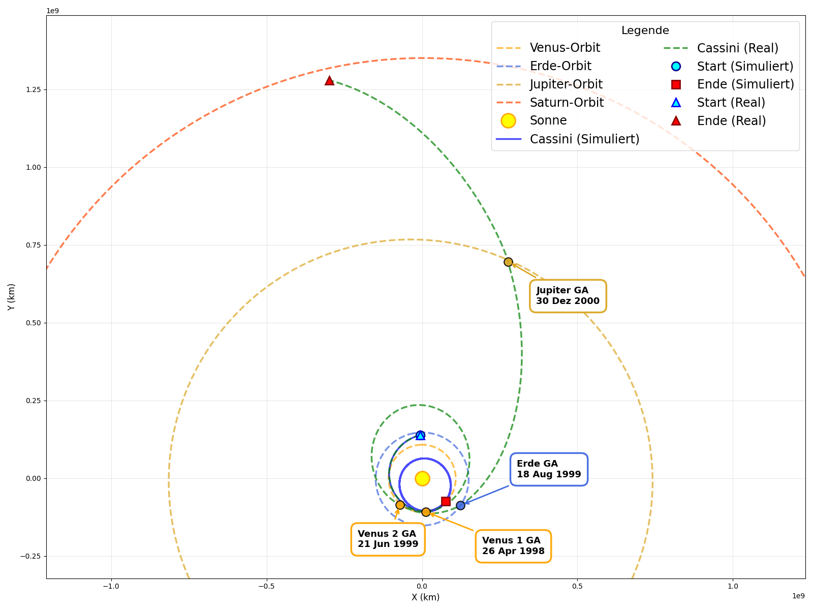
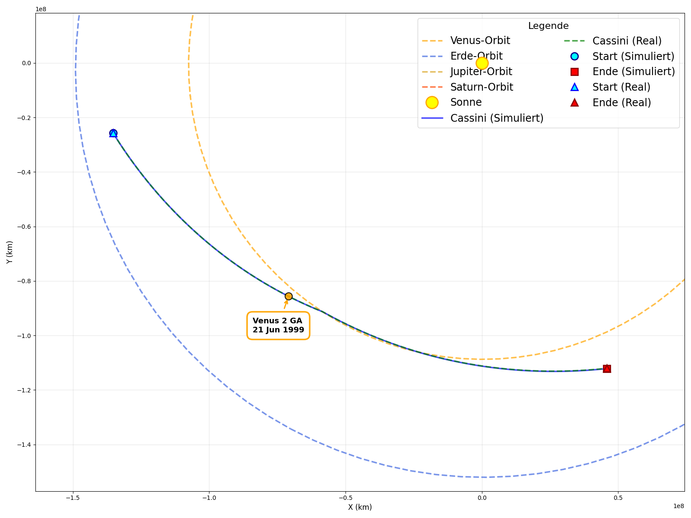

# Cassini-Huygens Trajectory Simulation

[](https://www.python.org/)
[](LICENSE)

This repository contains my W-Seminar (scientific research seminar) project for Physics at Humboldt-Gymnasium Vaterstetten, Germany. It is a numerical simulation of the Cassini-Huygens spacecraft's interplanetary trajectory and its gravity-assist maneuvers using the Runge-Kutta integration method and NASA's SPICE toolkit. I hope you find it interesting and useful - and that you have a good translation software for the German tech report :-)




## Abstract

This project simulates the complete interplanetary trajectory of NASA's Cassini-Huygens mission from January 1998 to January 2004, including all four gravity-assist maneuvers (Venus-Venus-Earth-Jupiter, VVEJGA). The simulation was developed as part of a W-Seminar (scientific research seminar) in Physics at Humboldt-Gymnasium Vaterstetten, Germany.

**Key Findings:**
- Successfully simulated individual gravity-assist maneuvers with high accuracy
- Demonstrated that simplified models (considering only gravitational forces and thruster firings) can accurately simulate short-duration trajectory segments
- Identified numerical integration challenges for long-duration missions, primarily due to rounding errors and error propagation

The simulation uses a 5th-order Runge-Kutta method (RK5(4)) with adaptive step sizing and validates results against real trajectory data from NASA's SPICE ephemeris kernels.

## About the Cassini-Huygens Mission

The Cassini-Huygens mission featured "the most complex gravity-assist trajectory ever flown" (Bellerose, 2019), utilizing four gravity-assist maneuvers to reach Saturn. Launched in October 1997 with a mass of 5,570 kg, the spacecraft was too heavy for a direct trajectory with available rockets. The VVEJGA trajectory enabled the mission to reach Saturn in under 7 years, arriving on July 1, 2004. Cassini spent 13 years orbiting Saturn while the Huygens probe successfully landed on Titan, providing groundbreaking scientific data.

## Technical Highlights

### Numerical Integration
- **Method:** 5th-order Runge-Kutta with 4th-order error estimation (RK5(4))
- **Adaptive Step Sizing:** Automatic adjustment based on local error estimates
- **Optimized Tolerances:** `rtol=1e-11`, `atol=1e-14`, `max_step=0.1 days`
- **Reference Frame:** J2000 ecliptic coordinate system (heliocentric)

### Data Sources
- **NASA SPICE Toolkit:** Planetary ephemerides, spacecraft states, and physical constants
- **Historical Maneuver Data:** Delta-V vectors and timing from JPL navigation team
- **Validation Data:** Real Cassini trajectory kernels for comparison

### Physical Model
- Gravitational interactions
- Impulsive maneuver modeling with mass changes
- Barycentric corrections for gas giants

## Download SPICE Kernels

The simulation requires NASA SPICE kernels for planetary ephemerides and spacecraft trajectory data. Create a `kernels/` directory and download the following files:

**Required Kernels:**

| Kernel File | Type | Description | Download Link |
|------------|------|-------------|---------------|
| `naif0012.tls` | LSK | Leap seconds kernel | [NAIF Generic Kernels](https://naif.jpl.nasa.gov/pub/naif/generic_kernels/lsk/) |
| `pck00010.tpc` | PCK | Planetary constants | [NAIF Generic Kernels](https://naif.jpl.nasa.gov/pub/naif/generic_kernels/pck/) |
| `de440.bsp` | SPK | Planetary ephemeris (DE440) | [NAIF Generic Kernels](https://naif.jpl.nasa.gov/pub/naif/generic_kernels/spk/planets/) |
| `co_1997319_99311_i_cru_v1.bsp` | SPK | Cassini trajectory (1997-1999) | [Cassini SPICE Archive](https://naif.jpl.nasa.gov/pub/naif/CASSINI/kernels/spk/) |
| `co_1999312_01066_o_cru_v1.bsp` | SPK | Cassini trajectory (1999-2001) | [Cassini SPICE Archive](https://naif.jpl.nasa.gov/pub/naif/CASSINI/kernels/spk/) |
| `041014R_SCPSE_01066_04199.bsp` | SPK | Cassini trajectory (2001-2004) | [Cassini SPICE Archive](https://naif.jpl.nasa.gov/pub/naif/CASSINI/kernels/spk/) |
| `jup365.bsp` | SPK | Jupiter system ephemeris | [NAIF Generic Kernels](https://naif.jpl.nasa.gov/pub/naif/generic_kernels/spk/satellites/) |
| `sat441.bsp` | SPK | Saturn system ephemeris | [NAIF Generic Kernels](https://naif.jpl.nasa.gov/pub/naif/generic_kernels/spk/satellites/) |
| `ura111xl-799.bsp` | SPK | Uranus system ephemeris | [NAIF Generic Kernels](https://naif.jpl.nasa.gov/pub/naif/generic_kernels/spk/satellites/) |
| `nep097.bsp` | SPK | Neptune system ephemeris | [NAIF Generic Kernels](https://naif.jpl.nasa.gov/pub/naif/generic_kernels/spk/satellites/) |

Just copy/paste the following into your shell (Windows):

```bash
# Create kernels directory
mkdir kernels
cd kernels

# Download generic kernels
wget https://naif.jpl.nasa.gov/pub/naif/generic_kernels/lsk/naif0012.tls
wget https://naif.jpl.nasa.gov/pub/naif/generic_kernels/pck/pck00010.tpc
wget https://naif.jpl.nasa.gov/pub/naif/generic_kernels/spk/planets/de440.bsp

# Download Cassini trajectory kernels
wget https://naif.jpl.nasa.gov/pub/naif/CASSINI/kernels/spk/co_1997319_99311_i_cru_v1.bsp
wget https://naif.jpl.nasa.gov/pub/naif/CASSINI/kernels/spk/co_1999312_01066_o_cru_v1.bsp
wget https://naif.jpl.nasa.gov/pub/naif/CASSINI/kernels/spk/041014R_SCPSE_01066_04199.bsp

# Download satellite system kernels
wget https://naif.jpl.nasa.gov/pub/naif/generic_kernels/spk/satellites/jup365.bsp
wget https://naif.jpl.nasa.gov/pub/naif/generic_kernels/spk/satellites/sat441.bsp
wget https://naif.jpl.nasa.gov/pub/naif/generic_kernels/spk/satellites/ura111xl-799.bsp
wget https://naif.jpl.nasa.gov/pub/naif/generic_kernels/spk/satellites/nep097.bsp

cd ..
```
## Usage

### Basic Simulation

Run the complete simulation:
```bash
python main.py
```

This will:
1. Load SPICE kernels and maneuver data
2. Simulate the trajectory from Jan 1998 to Jan 2004
3. Generate comparison plots with real trajectory data
4. Save results to `Simulation_Results/`

### Configuration

Edit `config.py` to customize:

```python
# Time range
START_UTC = "1998-01-01 00:00:00"
END_UTC = "2004-01-01 00:00:00"

# Integration parameters
RTOL = 1e-11  # Relative tolerance
ATOL = 1e-14  # Absolute tolerance
MAX_STEP = 0.1  # Maximum step size (days)
```

### Extract Maneuver Data

To extract delta-V data from SPICE kernels:
```bash
python extract_maneuver_deltav.py
```

## Project Structure

```
Cassini-Trajectory-Sim/
├── main.py                          # Main simulation entry point
├── config.py                        # Configuration parameters
├── spice_manager.py                 # SPICE kernel management
├── dynamics.py                      # Gravitational dynamics calculations
├── integration_impulse.py           # RK5(4) integration with maneuvers
├── maneuvers_impulse.py             # Maneuver timing and delta-V handling
├── plotting.py                      # Visualization functions
├── extract_maneuver_deltav.py       # Maneuver data extraction utility
├── requirements.txt                 # Python dependencies
├── data/
│   ├── maneuver_delta_v_vectors.csv # Delta-V vectors for all maneuvers
│   └── maneuver_delta_v_mass.csv    # Spacecraft mass timeline
├── kernels/                         # NASA SPICE ephemeris kernels (not included in repository)
│   ├── naif0012.tls                 # Leap seconds kernel
│   ├── pck00010.tpc                 # Planetary constants
│   ├── de440.bsp                    # Planetary ephemeris (DE440)
│   ├── co_*.bsp                     # Cassini trajectory kernels
│   └── *.bsp                        # Planet/moon system kernels
├── Simulation_Results/              # Output directory (auto-created)
│   ├── mission_overview_*.png       # Trajectory comparison plots
│   ├── error_*.png                  # Error analysis plots
│   └── *.html                       # Interactive 3D visualizations
└── W-Arbeit/                        # Research paper (German)
    └── Abbildungen/                 # Figures and diagrams
```

## Output

Output is saved in `Simulation_Results/`:

### Results

| Gravity-Assist | Avg. Position Error Growth (km/day) | Avg. Velocity Error (m/s) | Relative Error (%) |
|----------------|-------------------------------------|---------------------------|-------------------|
| Venus 1        | 11,916.43                          | 237.13                    | 0.56%            |
| Venus 2        | 1,733.73                           | 89.65                     | 0.20%            |
| Earth          | 50,908.68                          | 1,116.51                  | 2.96%            |
| Jupiter        | 63.41                              | 0.73                      | 0.0056%          |


## Limitations and Future Improvements

### Current Limitations
- Point-mass approximation for celestial bodies
- Impulsive (instantaneous) maneuver model
- Neglects solar radiation pressure
- Neglects thermal recoil effects
- Accumulation of rounding errors over long durations

### Potential Improvements
- Continuous thrust modeling for maneuvers
- Solar radiation pressure modeling
- Non-spherical gravity field models (J2, J4 terms)
- Higher-precision arithmetic (extended precision)
- Inclusion of smaller bodies (asteroids, additional moons)

## Acknowledgments

Special thanks to **Duane Roth**, Lead of the Cassini-Huygens Navigation Team at NASA's Jet Propulsion Laboratory, for his support in reconstructing historical maneuver data, which was crucial for this research.

This project was developed as part of the W-Seminar "Modeling and Simulation" in Physics at Humboldt-Gymnasium Vaterstetten, supervised by Wolfgang Guggenberger.

## References

See the full technical report: [Simulating the Cassini-Huygens Trajectory.pdf](https://github.com/linusrichert/Cassini-Trajectory-Sim/blob/main/Simulating%20the%20Cassini-Huygens%20Trajectory.pdf)

